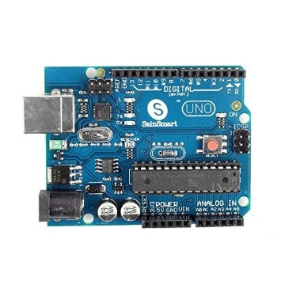
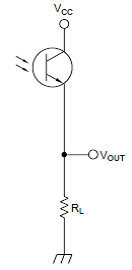
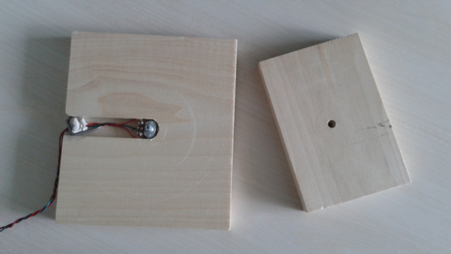
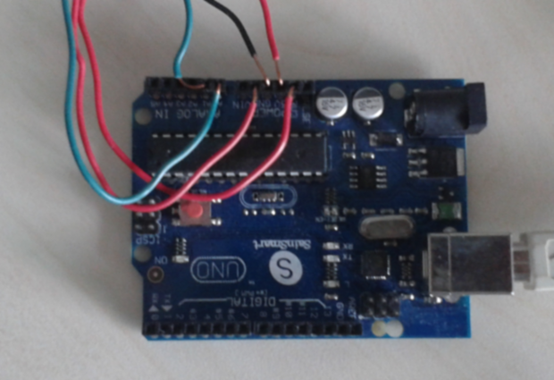

# Building *Latent* measurement devices

This document describes how to build the hardware devices
for the *Latent* test programs for virtual-reality (VR) systems.

## vrpn_device_latency_test/arduino_inputs_latency_test

The *vrpn_device_latency_test* program estimates the latency between
a potentiometer attached to an Arduino and a *vrpn_Analog* or *vrpn_Tracker*
device.  These devices can be either run with a local server (described
by a configuration file) or connected to an externally-run server (using
a full VRPN device name).

The *arduino_inputs_latency_test* does the same, but using two inputs
from an Arduino (the potentiometer on analog input 0 and the other on
analog input 1).  It is designed to work with a phototransistor input
to measure light and has a special filtered version of the
*vrpn_streaming_arduino* software that runs on the Arduino to deal with
the large ouput impedance from having a 500 kOhm resisitor in series
with the phototransistor.

Both of these require a rotary potentiometer to be hooked up to analog
input 0 of the Arduino and the second requires a phototransistor (or other)
circuit to be hooked up to analog input 1.

### The basic board

A prototype unit was built using an Arduino Uno board.  The particular
board used was the SainSmart UNO ATmega328P, which was purchased
through [Amazon.com](http://smile.amazon.com/SainSmart-ATmega328P-CABLE-Included-Arduino/dp/B006GX8IAY/ref=sr_1_5?s=electronics&ie=UTF8&qid=1422119284&sr=1-5&keywords=arduino+uno) for $17.69.

### Connecting the devices

Viewing the screen brightness can be done using an IR phototransistor
purchased at Radio Shack, which also operated in the visible-light
range (part number 276-0145, $1.99).  It can be hooked up according
to the SHARP Optoelectronics Photodiode/Phototransistor Application
Circuit (see left). To produce voltages that changed over a range,
a 500kΩ resistor (RL) can be placed in series with the phototransistor.
To make the values be larger for brighter light, a common-collector
configuration with the resistor placed between the transistor output
and ground can be used.  Plug the Vcc line into 5V power, the ground
into GND, and the Vout into analog input 1.

There is only one 5V power connection on the header, and two wires
don't fit into it.  However, it is possible to use the 3.3V power
output to drive the potentiometer, it merely reduces its voltage
range.  There are two ground connectors, so it can get its own
ground.  Its signal lead plugs into the analog in 0 header.

**Noise:** Reduce the system's susceptibility to external electromagnetic
interference by twisting the wires from the measurement devices
around each other so that there is a small cross-section between
them.

### Handling high-impedance circuits

When I used two different input channels (0 and 1), I saw
voltages from one affecting the other, even for slowly-
changing signals.  A comment was made on one of the forums
that you should read a channel twice when switching between
channels and throw away the first reading, and that's what
we're doing here.  Doing just one read in between was not
enough to remove this affect on my board, so I did a bunch
of them.  It takes about 100 microseconds for
each read (according to the onling documentation for
analogRead()).

Observation with an oscilloscope revealed that there was an
actual voltage change on the line when the analog reader was
switched to a phototransistor input from a potentiometer.  When it was
switched from the phototransistor back to the potentiometer,
there was no blip on the potentiometer.

The documentation reported a 10kOhm resistor on the photo-
transistor, but measurement found it more like 500 kOhms.
Arduino forums recommend a resistance of more like 10 kOhms
on the inputs.  Switching to an impedance of 25 kOhms dropped
the signal to 0 on the phototransistor.

The decay time for the signal is around 1ms when it is
switched to the phototransistor channel.

**Alternatives:** Stopping reading the potentiometer channel removed the
cross-talk.  Placing a grounded analog input on the channel
that is read immediately ahead of the phototransistor caused
the voltage to come up from 0 over about 1ms; this at least had
a constant scaling factor on the values being read (as opposed
to following a channel with varying voltage).

## Constructing the unit

The potentiometer needs to be installed inside a stand that can rotate
with an HMD on top of it, so that the angle of the potentiometer can
be compared to the tracking data and to the images on the screen.  I
made a prototype stand using two pieces of scrap wood, as seen below.

Before starting, note the wiring on the potentiometer.  I used red
wires for the outer two connectors and green for the center.
This lets me know that the green wire goes to the analog input and
the other two to the power supply voltage and ground.

I found a drill bit that was slightly narrower than the knob on the
top of the potentiometer and used a drill press to make a hole in
the center of the top board.  Then I found a bit that was slightly
larger than the screw threads on the potentiometer and widenend the
bottom part of the hole so that it would fit.

The potentiometer can be mounted in the top board such that when
it is all together the center location has the boards aligned.
(On a round base, this would not be needed.)
By sticking the potentiometer into the hole (friction fit), I was
able to measure how far it stuck out the bottom of the board and
marked this depth on the side of the lower board.

Leaving a bit of extra space (maybe 1/32") for epoxy to form around
the base, I used a router table with a 3/4" bit to carve a channel
from slightly past the center of the bottom board to one edge, making
a place for the potentiometer to sit and for the wires to exit.

After checking the fit, I mixed epoxy and placed it in the routed
channel around where the potentiometer would sit, making sure not
to get any up around the top of the channel (to avoid sticking the
top board to the bottom one).  I then used the top board to press
the potentiometer into the epoxy and left it to set up overnight.

After using the board for a while, I noticed that the wiring
tended to get caught on the top board.  A wiring staple hastily
applied serves to keep the wiring marshalled, along with some
adhesive putty.  Not pretty, but serviceable.

## Connecting the devices

The image below shows the wiring.

The leads from the potentiometer come from below in the image.
The green wire attaches to analog
input 0.  The two red wires attach to one of the ground pins and
to the 3V power lead (leaving the 5V lead available for the photo
transistor); the two red wires can attach in either polarity.

The leads from the phototransistor come in from the top.  The
green lead (attached to Vout) attaches to analog input 1.  The
red wire (Vcc) attaches to the 5V power supply and the black
lead (ground) attaches to one of the ground pins.